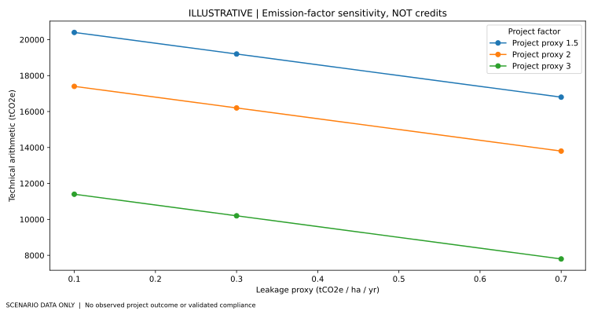

The project separates three categories of information: **(a) dated source-document assertions**, **(b) independent regulatory/methodology references** and **(c) invented parameter scenarios**. Do not mix these in a results table.

## An illustrative accounting identity

$$ D = A \times T \times (B - P - L) $$

Here $D$ is the technical difference in tCO₂e under chosen hypothetical proxies, $A$ is assumed eligible hectares, $T$ is scenario years, and $B$, $P$, $L$ are user-provided illustrative rates per hectare-year. The formula **is not a methodology-specific carbon calculation**; it omits dynamic baselines, project-specific adjustments and eligibility.

The author document's 10.8 tCO₂e/ha/yr and US$70 statements are stored in the **unverified claims ledger**. Neither is used as a certified unit or a market price.

## Reproduce

Run `python -m pytest && python scripts/run_all.py`. The generated `outputs/ILLUSTRATIVE_monte_carlo.json` uses a fixed random seed solely to make technical sensitivity analysis reproducible. Review the [uncertainty caveats](../docs/METHODOLOGY_SEPARATION.md) before reusing the code.

## Competing explanations / exclusion risks

Changes in management practice may influence GHG fluxes through more than one pathway. A practice stack must avoid allocating the same methane changes to separate methods or combining SOC claims without repeated soil measurements and uncertainty control. Unregistered, unverified calculations do not represent tradable offsets.

## Generated illustration

This figure is computed solely from the explicitly illustrative input CSVs. It is not a project fact or statistically estimated quantity.

## Static reproducibility snapshot

View the [worked illustrative input-to-output table](../docs/ILLUSTRATIVE_RESULTS_PREVIEW.md), regenerated by a deterministic analysis run. This is not an empirical estimate.
